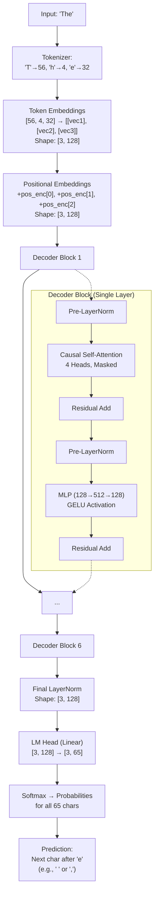

# 🧠 GPT-Mini

*A compact GPT-style language model built from scratch, trained on Shakespeare.*
Learns character-level patterns, style, and rhythm from Shakespeare’s works.
Fully implemented in PyTorch with a decoder-only Transformer architecture.

---

### 🎬 Demo

[GPT-Mini Demo](https://youtu.be/FSzQwOj5jyA)

*Click to watch GPT-Mini generate Shakespearean text in real time.*

---

## 📖 Overview

**GPT-Mini** is a decoder-only Transformer implemented in **PyTorch**, trained on the complete works of Shakespeare (~1.1M characters).

It learns **character-level language modeling**, capturing voice, structure, and rhythm from Shakespeare’s plays and poetry.

---

## ⚡ Model Workflow

```
Prompt → Tokenize → Embed → [Decoder ×6] → Linear → Softmax → Next Character
```

### 🧩 Components

1. **Tokenizer**

   * Character-level: each character → unique token
   * No subword or BPE tokenization

2. **Embeddings**

   * Token embedding + **learned positional embeddings** (GPT-style)

3. **Decoder Block (×6)**

   * **Pre-LayerNorm** → Causal Self-Attention → Residual
   * **Pre-LayerNorm** → Feedforward (4× width, GELU) → Residual

4. **Output**

   * Linear projection tied to token embeddings
   * Softmax for next-character probabilities

5. **Generation**

   * Autoregressive, supports **temperature** and **top-k sampling**

---

### 🔹 Example Flow: Input Text `"The"`



**Autoregressive Generation Loop:**
1.  Model predicts the most likely next character (e.g., a space `' '`).
2.  This character is appended to the input sequence (`"The "`).
3.  The process repeats, using the updated sequence as input, predicting the next character, and appending it.
4.  Continues until the maximum sequence length (e.g., 256 characters) is reached or a stopping condition is met.

---

## 📊 Model Specifications

| Component           | Details                  |
| ------------------- | ------------------------ |
| Architecture        | Decoder-only Transformer |
| Layers              | 6                        |
| Embedding Dim       | 128                      |
| Attention Heads     | 4                        |
| Context Length      | 256                      |
| Vocabulary Size     | 65 (character-level)     |
| Parameters          | 1.23M                    |
| Positional Encoding | Learned embeddings       |
| LayerNorm           | Pre-attention & pre-MLP  |
| Training Steps      | 10,000 (~on GPU)         |

---

## 🏆 Results

| Metric             | Value |
| ------------------ | ----- |
| Perplexity         | 3.02  |
| Character Accuracy | 64.9% |
| NLL                | 1.105 |
| BPC                | 1.594 |

> Evaluated on held-out Shakespeare text. Metrics stored in `evaluation_metrics.json`.

---

## 📂 Project Structure

```
gpt-mini/
├── src/model/          # attention.py, transformer.py, embeddings.py
├── src/data/           # tokenizer.py, dataloader.py
├── src/train/          # trainer.py, config.py
├── src/utils/          # debug.py, export.py
├── configs/gpt1_char.yaml
├── deploy/app.py       # Gradio: Generate + Evaluate
├── tests/              # Unit tests
├── data/tinyshakespeare.txt
├── train.py
└── evaluation_metrics.json
```

---

## 🚀 How to Run

```bash
python deploy/app.py
```

* Type a prompt (e.g., `"To be or not to"`)
* Generates text character-by-character in Shakespearean style

---

## 📚 References

* **Transformer architecture**: Vaswani et al., *Attention Is All You Need* (2017)
* **Positional embeddings in GPT**: Learned embeddings, GPT-2 style
* Educational guidance: [Karpathy, “Let’s build GPT from scratch”](https://youtu.be/kCc8FmEb1nY)

> All code and implementation are original, reflecting the design and behavior described.

---

## 🌟 Philosophy

Small. Transparent. Understandable.
GPT-Mini captures **how transformers generate language**, with focus on clarity and understanding.

---
